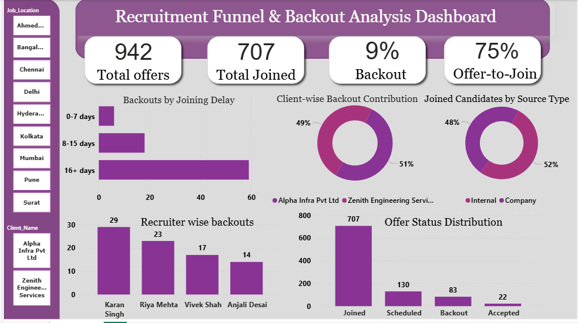

# Onboarding Dashboard
Power BI dashboard analyzing recruitment funnel, offer-to-join conversion ratio, and backout patterns with delay-based insights.

# Recruitment Funnel & Backout Analysis Dashboard

## Project Overview

The Recruitment Funnel & Backout Analysis Dashboard is designed to analyze the hiring conversion process from offer release to final candidate joining.

This dashboard helps track offer-to-join conversion rates, identify backout patterns, and analyze delay-based drop-offs to improve recruitment efficiency and decision-making.

---

## Business Objective

- Track overall Offer-to-Join ratio  
- Measure Backout Percentage  
- Identify delay impact on candidate drop-offs  
- Evaluate Client-wise performance  
- Analyze Recruiter-wise conversion rates  
- Enable data-driven recruitment decisions  

---

- ## Tech Stack

The dashboard was built using the following tools and technologies:

- **Power BI Desktop** – Primary data visualization platform used for interactive report creation and dashboard development.  

- **Power Query** – Data transformation and cleaning layer used for reshaping, structuring, and preparing raw data for analysis.  

- **DAX (Data Analysis Expressions)** – Used for creating calculated measures, dynamic KPIs, conditional logic, and performance metrics.  

---

## Data Source

The dataset used in this project is a simulated recruitment dataset created for analytical demonstration purposes.

It includes:
- Offer details  
- Candidate joining status  
- Client information  
- Recruiter performance  
- Joining delay duration  
- Sourcing channels  

Note: No real company data has been used.

---

## Key Features

- KPI Cards (Total Offers, Total Joined, Backout %, Offer-to-Join Ratio)  
- Client-wise Offer & Joining Analysis  
- Recruiter Performance Tracking  
- Delay-Based Backout Trend Analysis  
- Recruitment Funnel Conversion Tracking  
- Interactive Slicers (Client & Location Filters)  
- Source Contribution Analysis  

---

## Key Insights

- Candidates with 16+ days joining delay show the highest drop-off rate.  
- Certain clients contribute higher backout percentages.  
- Internal sourcing channels demonstrate better conversion performance.  

---

## Business Impact

This dashboard enables recruitment teams to:

- Reduce candidate drop-offs  
- Minimize joining delays  
- Improve offer-to-join conversion ratio  
- Identify high-risk clients  
- Make informed, data-driven hiring decisions  

---
## Dashboard Preview

